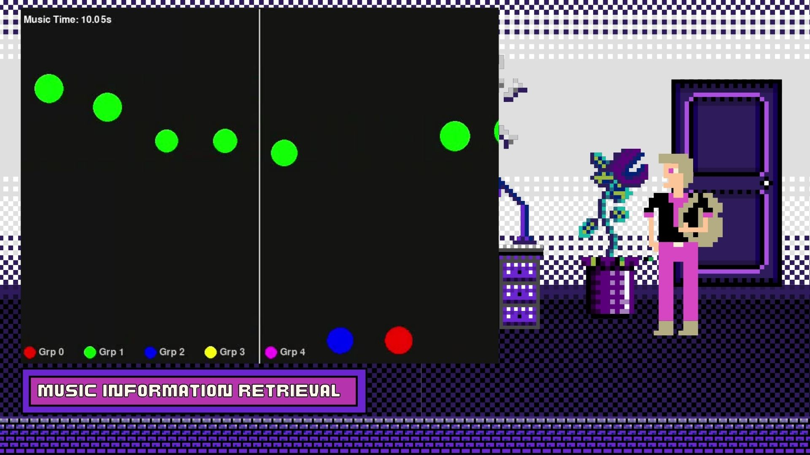
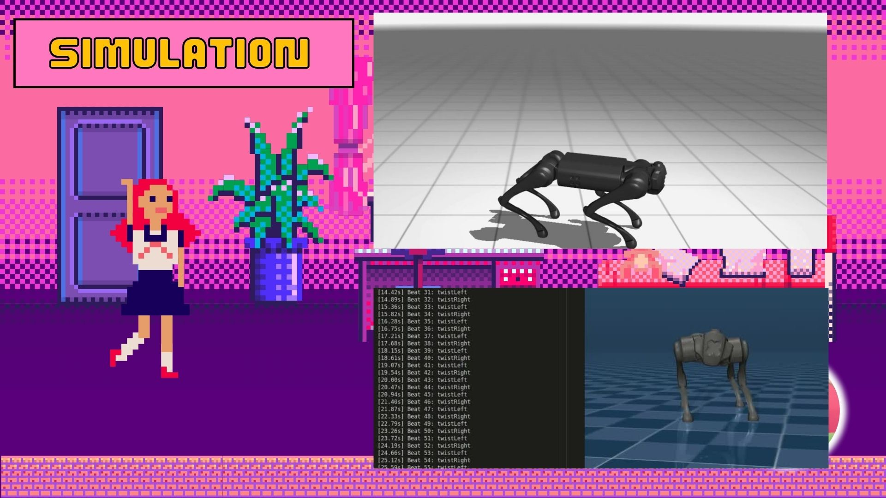
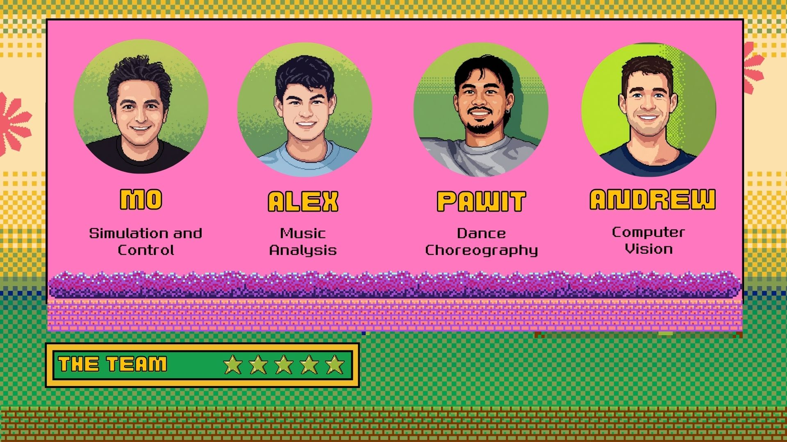

<p align="center">
  
</p>

<h1 align="center">Team YMCA - Making Robots Dance</h1>

<p align="center">
  <strong>Winner of the Most Technical Award at The Robot Rave Hackathon 2026</strong>
</p>

<p align="center">
  <a href="#demo">Demo</a> •
  <a href="#features">Features</a> •
  <a href="#quick-start">Quick Start</a> •
  <a href="#the-team">Team</a> •
  <a href="#architecture">Architecture</a>
</p>

<p align="center">
  
  
  
  
</p>

---

## The Story

On January 17th, 2026, at **The Robot Rave** hackathon in London, four engineers came together with one mission: **make a robot dog dance to YMCA like Trump**.

What started as a wild idea became a fully-featured robotics platform with real-time choreography, music synchronization, and sim-to-real transfer. We built everything from scratch in 12 hours - and won the **Most Technical Competence Award**.

> *"At Cocoa and SoTA we believe in the importance of culture for technoscientific progress... And what more human way to celebrate the culture of technological progress, optimism, and ambition than a dancing robot – the ultimate expression of the joy and hope we want to cultivate for the future."*

---

## Demo

<p align="center">
  
  <br>
  <em>The real Unitree Go1 performing our YMCA choreography</em>
</p>

<p align="center">
  
  <br>
  <em>Building the dance in our custom choreography editor</em>
</p>

<p align="center">
  
  <br>
  <em>The inspiration: Trump's iconic YMCA dance</em>
</p>

---

## Features

### Choreography Editor
A professional timeline editor for robot dance choreography - think Adobe Premiere, but for robot moves.

<p align="center">
  
</p>

- Waveform visualization synced to music
- Drag & drop move markers on timeline
- Zoom in/out for precise timing (1000%+ zoom)
- Debug mode: flag timestamps while music plays
- Save/Load choreography as JSON
- Real-time playback with robot execution
- Undo/Redo support

### Control Dashboard
Complete control panel for the Unitree Go1 robot.

<p align="center">
  
</p>

- All robot modes (Stand, Walk, Dance, etc.)
- Custom dance sequences (Wave, Nod, Shake, Bounce, Groove, Twist, Wiggle, Hip Shake)
- Body pose controls (Look Up/Down, Lean, Twist, Squat, Extend)
- LED color control
- Sequence recording & playback
- Real-time action logging with timing stats

### Music Information Retrieval
Beat detection and music analysis for automatic choreography generation.

<p align="center">
  
</p>

- Beat detection using Librosa
- YMCA song analysis (129 BPM)
- Move timing suggestions based on beats
- Visual beat representation

### MuJoCo Simulation
Test choreographies in simulation before deploying to real hardware.

<p align="center">
  
</p>

- Full physics simulation with MuJoCo
- Keyboard control for testing
- Sim-to-real transfer
- Same commands work in sim and on real robot

---

## Quick Start

```bash
# Clone the repository
git clone https://github.com/dawodx/YMCA.git
cd YMCA

# Run setup (creates venv + installs dependencies)
./setup.sh

# Activate environment
source .venv/bin/activate

# Run the tools:
python mo_simulation/go1_dashboard.py      # Control Dashboard (port 8890)
python mo_simulation/go1_choreographer.py  # Choreography Editor (port 8894)

# Run MuJoCo simulation
.venv/bin/mjpython mo_simulation/go1_sim_server.py
```

### Connecting to Real Robot

```bash
# Network setup for Unitree Go1:
# 1. Connect Go1 via Ethernet
# 2. Set your IP to: 192.168.123.xxx
# 3. Go1 IP is: 192.168.123.161

# Then use the dashboard to connect and control
python mo_simulation/go1_dashboard.py
```

---

## The Team

<p align="center">
  
</p>

| | Name | Role | LinkedIn |
|---|------|------|----------|
| | **Mo Dawod** | Simulation & Control | [linkedin.com/in/dawod](https://www.linkedin.com/in/dawod/) |
| | **Alex Daniel** | Music Analysis | [linkedin.com/in/a-daniel](https://www.linkedin.com/in/a-daniel/) |
| | **Pawit Kochakarn** | Dance Choreography | [linkedin.com/in/pawit-kochakarn](https://www.linkedin.com/in/pawit-kochakarn-58975a152/) |
| | **Andrew Walsh** | Computer Vision | [linkedin.com/in/andrewwalsh-tech](https://www.linkedin.com/in/andrewwalsh-tech/) |

---

## Architecture

```
┌─────────────────────────────────────────────────────────────────┐
│                     CHOREOGRAPHY EDITOR                         │
│  Timeline • Waveform • Drag & Drop • Save/Load • Playback       │
└────────────────────────────┬────────────────────────────────────┘
                             │
         ┌───────────────────┼───────────────────┐
         │                   │                   │
         ▼                   ▼                   ▼
┌─────────────────┐ ┌─────────────────┐ ┌─────────────────┐
│  MUSIC ANALYSIS │ │ CONTROL DASHBOARD│ │   SIMULATION    │
│                 │ │                  │ │                 │
│  • Beat detect  │ │  • Robot modes   │ │  • MuJoCo sim   │
│  • BPM analysis │ │  • Dance moves   │ │  • Keyboard     │
│  • Librosa      │ │  • LED control   │ │  • Sim server   │
└────────┬────────┘ └────────┬─────────┘ └────────┬────────┘
         │                   │                    │
         └───────────────────┼────────────────────┘
                             │
                             ▼
                  ┌─────────────────────┐
                  │    UNITREE GO1      │
                  │    Real Robot       │
                  │                     │
                  │  • go1pylib SDK     │
                  │  • MQTT commands    │
                  │  • Real-time pose   │
                  └─────────────────────┘
```

## Project Structure

```
YMCA/
├── mo_simulation/           # Core simulation and control
│   ├── go1_choreographer.py # Timeline choreography editor
│   ├── go1_dashboard.py     # Robot control dashboard
│   ├── go1_sim_server.py    # MuJoCo simulation server
│   ├── go1_commands.py      # Shared command definitions
│   ├── go1_pose_builder.py  # Custom pose creator
│   ├── go1_param_editor.py  # Parameter tuning
│   └── choreography/        # Saved choreography files
├── alex_music/              # Music analysis
│   ├── beat_visualizer.py   # Beat visualization
│   ├── rhythm_parser.py     # Rhythm detection
│   └── song_parser.py       # Song analysis
├── pawit_control/           # Dance choreography
│   └── dance_mujoco.py      # MuJoCo dance integration
├── andrew_vision/           # Computer vision
│   └── README.md            # Vision pipeline docs
├── shared/                  # Shared utilities
│   └── config.py            # Configuration
├── models/                  # Robot models
│   └── unitree_go1/         # Go1 MJCF model
├── docs/media/              # Images and demos
├── setup.sh                 # Setup script
└── requirements.txt         # Dependencies
```

## Tools Reference

| Tool | Port | Command |
|------|------|---------|
| Dashboard | 8890 | `python mo_simulation/go1_dashboard.py` |
| Sim Server | 8891 | `mjpython mo_simulation/go1_sim_server.py` |
| Pose Builder | 8892 | `python mo_simulation/go1_pose_builder.py` |
| Param Editor | 8893 | `python mo_simulation/go1_param_editor.py` |
| Choreographer | 8894 | `python mo_simulation/go1_choreographer.py` |

## Controls (Keyboard Simulation)

| Key | Action |
|-----|--------|
| W/S | Body height up/down |
| Arrow Keys | Lean forward/back/left/right |
| A/D | Yaw left/right |
| 1/2/3/4 | YMCA poses |
| Space | Reset to stand |
| Esc | Quit |

---

## The Event

**The Robot Rave** was a hackathon-meets-performance organized by [SoTA (Society for Technological Advancement)](https://sota.world) and [Cocoa](https://cocoa.gg) in London on January 17th, 2026.

Engineers, founders, and artists came together to make robots dance, culminating in a Robot Dance Competition at Maggie's, London's iconic 80s club.

---

## Acknowledgments

- **SoTA & Cocoa** for organizing an incredible hackathon
- **Unitree** for the Go1 robot platform
- **MuJoCo** for the physics simulation
- **The Village People** for YMCA (and Trump for the dance moves)

---

<p align="center">
  
</p>

<p align="center">
  <strong>Made with passion at The Robot Rave 2026</strong>
  <br>
  <em>Let's make robots dance!</em>
</p>

---

## License

MIT License - see [LICENSE](LICENSE) for details.

